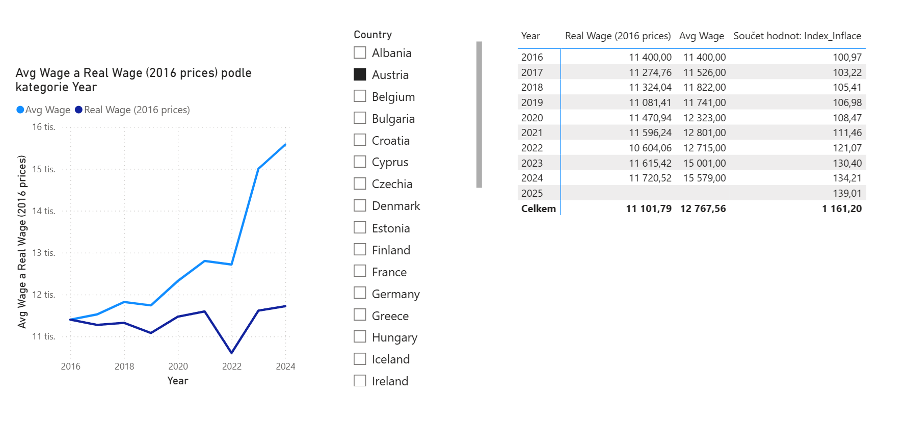

# Impact of Inflation on Public Sector Wages in Europe

## Project Overview

This Power BI project investigates how inflation influenced public sector wages across European countries between 2016 and 2025.
The analysis focuses on whether wage growth was sufficient to preserve real purchasing power and how inflation reshaped differences between countries over time.

The goal is not only to visualize wage trends, but to identify structural patterns in how different economies respond to inflationary pressure.

---

## Analytical Questions

* Did public sector wages keep pace with inflation across Europe?
* Which countries were most successful in protecting real wages?
* How did the post-2021 inflation shock change wage dynamics?
* Did inflation widen disparities between countries?

---

## Data Sources

* Eurostat – Harmonised Index of Consumer Prices (HICP)
* Eurostat – Public sector wages (annual data)

All datasets were cleaned, reshaped, and merged in Power Query to ensure comparability across countries and years.

---

## Methodology

### Real Wage Calculation

Nominal wages were adjusted for inflation using 2016 as the base year:

**Real Wage = Nominal Wage / (Inflation Index / Base Inflation)**

This transformation allows direct comparison of purchasing power across time.

### Time Analysis

* A Year dimension table was created for time intelligence
* Year-over-year real wage changes were calculated using DAX
* Trends were analyzed across both country and time dimensions

---

## Key Insights

* In many countries, nominal wage growth did not translate into higher purchasing power
* The inflation surge after 2021 created a clear break in wage trends
* Some countries show resilience due to institutional wage adjustment mechanisms
* Inflation increased divergence between European wage trajectories rather than affecting all countries uniformly

These findings illustrate how inflation can reshape income stability even within developed economies.

---

## Why This Matters

Understanding how inflation affects real wages is critical for:

* evaluating public sector compensation policies
* assessing income stability during economic shocks
* identifying structural differences between European labour markets

This type of analysis is directly relevant for policy evaluation, labour market research, and macroeconomic monitoring.

---

## Tools & Skills Demonstrated

* Power BI data modelling
* DAX measures for time intelligence
* Power Query data transformation
* Economic indicator analysis
* Comparative country analysis

---

## Project Files

The repository includes:

* Power BI report file (.pbix)
* Screenshots of key visuals
* Documentation of methodology and findings

---

## Visualizations

### Czech Republic

### Austria

